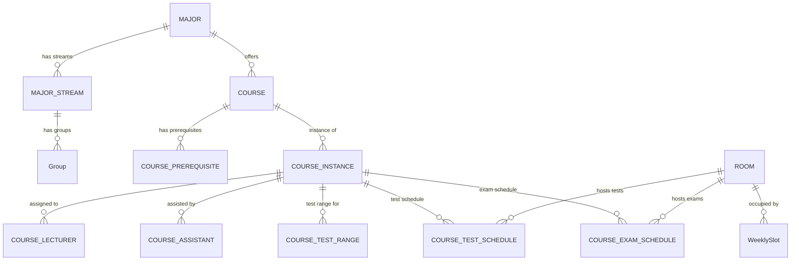
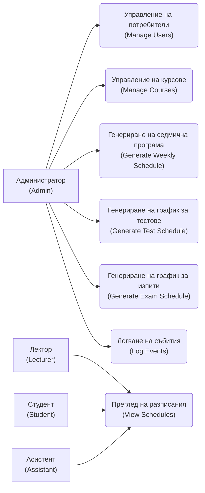
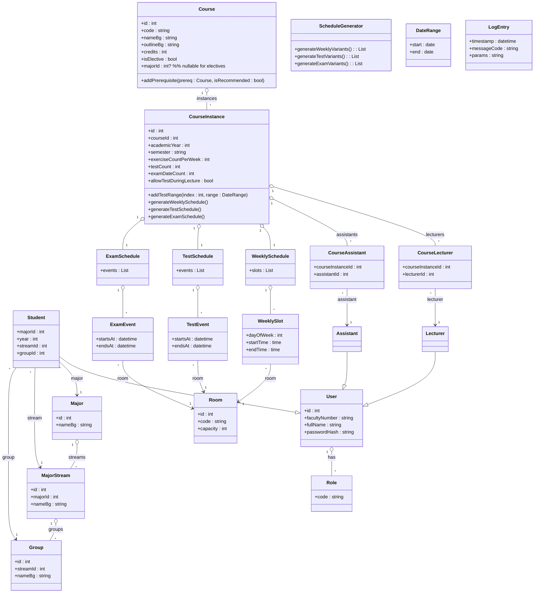
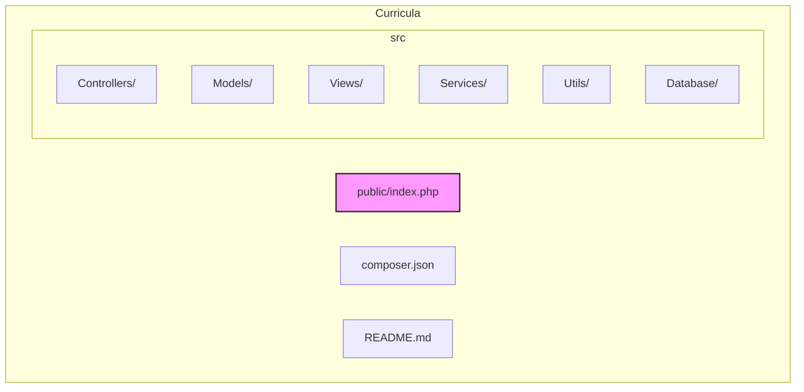

# Curricula - Software Requirements Specification

## Domain Description (Описание на домейна)

Curricula е уеб приложение за управление на **разписанията** (_schedules_) на специалностите (_majors_) във Факултета по математика и информатика (ФМИ) на Софийския университет. Системата обхваща: - Учебните семестри (зимен семестър: 1 октомври - 15 януари; летен семестър: 16 февруари - 15 юни), - Изпитните сесии (зимна: 16 януари - 15 февруари, летна: 16 юни - 15 юли, и контролна: 15 август - 15 септември).

### Основни същности и отношения

- **Курс (Course)** - учебна дисциплина, която може да бъде задължителна (_mandatory, задължителен_) или избираема (_elective, по избор_).
- Всеки курс има код, име (на български), лекция с контури (_outline_ на български език), брой кредити, и списък с предварителни изисквания (_prerequisites_). Някои предварителни изисквания са задължителни, други - препоръчителни.
- Избираемите курсове могат да се изучават от студенти от всички специалности, докато задължителните курсове се изучават само от студенти от конкретна специалност.
- **Курс Instance (CourseInstance, „паралелка") - конкретен план-паралелка на курс през даден семестър.**
- Свързан с един курс, предписан за конкретен семестър и академична година.
- Има 1-3 лектора (_lecturers, лектори_), 4-6 асистента (_assistants, асистенти_), брой упражнения на седмица, брой контролни тестове (_tests_), списък от допустими времеви диапазони за всеки тест, брой дати за изпит и т.н.
- След генериране на разписанието, всяка инстанция съдържа седмично разписание (за лекции и упражнения), разписание на контролни и разписание на изпити (за всяка дата на изпит).
- **Променливи и графици:**
- **Времеви интервал (TimeSpan)** - представлява начало (час) и край (час) в рамките на един ден. Започва винаги на кръгъл час и продължава цяло число часове.
- **Седмично разписание (Weekly Schedule)** - набор от записи, всеки съдържащ: ден от седмицата, **Времеви интервал (TimeSpan)**, аудитория (_Room_), тип занимание (лекция или упражнение), съответния **CourseInstance** и (за упражнения) **група (Group)**.
- **Разписание на контролни тестове (Test Schedule)** - график на всеки контролен тест за всеки **CourseInstance**. За всеки тест се задава дата, **Времеви интервал** и стая.
- **Разписание на изпитна сесия (Exam Schedule)** - график на изпитите за **CourseInstance**. За задължителни курсове разписанието се групира по специалности/потокове (_streams_), а за избираеми - глобално. Всяка входяща единица съдържа дата, **Времеви интервал**, стая и курс, заедно с индекса на съответния изпит.
- **Студент (Student, Студент)** - има уникален факултетен номер (до 10 символа), принадлежи към специалност (_Major, специалност_), година на обучение в съответната специалност, поток (_Major Stream, поток_) и група (_Group, група_) в потока.
- Структурата на студентските групи е йерархична: Специалност → Поток → Група. Примерно има 10-20 специалности, всяка със 1-2 потока, всеки поток със 3-6 групи по ~30 студенти.
- Студентът може да се записва (enroll) задължително или по избор в предлаганите курсове (задължителни курсове се записват автоматично).
- **Потребител (User, потребител)** - има роля(и): _Администратор (Admin)_, _Студент (Student)_, _Лектор (Lecturer)_ и/или _Асистент (Assistant)_. Асистент може едновременно да е студент или лектор, като допълнителните му права важат само за конкретните паралелки, в които асистира.
- **Учебна година (Academic Year, учебна година)** - системата съхранява данни само за текущата учебна година (година на образование); няма нужда от управление на минали/бъдещи години.
- **Аудитория (Room, стая)** - означена с 3-цифрен номер (1xx, 2xx, ...). Първата цифра е етаж (1-6), останалите са номер на стаята (до 30). Всяка стая има брой бели и черни дъски (бели/черни дъски ≥ 1).
- **Разписание (Schedule, разписание)** - представено от различна гледна точка: по специалност/поток, по студентска група, по лектор или като списък на избираемите курсове.
- **Генериране на разписания (Schedule Generation)** - ключова функционалност: автоматично създаване на седмични, контролни и изпитни разписания, спазвайки предварително дефинирани ограничения (Hard Constraints) и предпочитания (Soft Constraints).

### Глосарий на термини (Glossary)

- **Семестър (Semester, семестър)** - период на провеждане на учебни занятия (лекции, упражнения) - зимен или летен.
- **Изпитна сесия (Exam Session, изпитна сесия)** - период след края на семестъра, посветен на държане на изпити (зимна, летна, контролна).
- **Лекция (Lecture, лекция)** - основно занимание, провежда се веднъж седмично за всяка паралелка от курс.
- **Упражнение (Exercise, упражнение)** - практически занятия, провеждат се няколко пъти седмично (за дадена група).
- **Контролно (Test, контролно)** - междинен изпит (примерно 2 часа) по време на семестъра.
- **Изпит (Exam, изпит)** - финален изпит в изпитната сесия (примерно 3 часа); може да има до 3 дати за всеки CourseInstance.
- **Задължителен курс (Mandatory Course, задължителен)** - курс, включен в програмата на определена специалност. Студентите от тази специалност трябва да го вземат.
- **Избираем курс (Elective Course, избираем)** - курс, който студентите от всички специалности могат да избират свободно.
- **Поток (Major Stream, поток)** - подразделение на специалността (например „Информатика - поток 1").
- **Група (Group, група)** - учебна група в поток (например „Група 1").
- **Потребителска роля (User Role, роля)** - определя правата на потребителя (Admin, Student, Lecturer, Assistant).

## Functional Requirements (Функционални изисквания)

### Управление на потребители и роли (User & Role Management)

- **The system shall allow user registration and authentication with faculty number and password, assigning one or more roles (Admin, Student, Lecturer, Assistant).**  
    _Acceptance Criteria:_
- Administrators могат да създават, редактират и изтриват потребителски акаунти.
- Всеки потребител в системата има уникален faculty_number (макс. 10 символа) и парола (secure hash).
- Системата присвоява на потребителя една или повече роли. Например, потребител може да е едновременно Lecturer и Assistant.
- **Given** неавторизиран потребител, **when** се опита да посети защитена страница, **then** системата го пренасочва към страницата за вход.
- **The system shall maintain user-role assignments (many-to-many between User и ролите).**  
    _Acceptance Criteria:_
- Има таблица UserRole с FK към User и поле role (ENUM).
- Роли: ADMIN, STUDENT, LECTURER, ASSISTANT.
- Ролята ASSISTANT се дава само на потребители, които са вече STUDENT или LECTURER.

### Управление на курсове (Course Management)

- **The system shall allow Admin to create, read, update, and delete Courses.**  
    _Acceptance Criteria:_
- Атрибути на Course: код (уникален), име (на BG), outline (на BG), кредити, булев флаг is_elective, опционално FK към специалност (Major) за задължителен курс.
- Админ задава и списък от **предварителни изисквания (prerequisites)**: всяко Course може да има 0+ prereqs, всяко с флаг is_recommended (FALSE означава задължително изискване).
- **Given** нов курс без задължителни предпоставки, **when** админ го запази, **then** курсът се появява в списъка с курсове.
- **The system shall allow Admin to create, read, update, and delete Course Instances (паралелки) per semester.**  
    _Acceptance Criteria:_
- Атрибути на CourseInstance: FK към Course, учебна година, семестър (ENUM _WINTER_, _SUMMER_), брой упражнения/седмица, брой тестове, брой дати за изпит.
- Админ добавя 1-3 лектора и 0-6 асистенти (списъци със Student/ Lecturer).
- При създаване/редакция може да се въвеждат **допустими интервали за всеки контролен тест** (TestRange) и брой дати за изпит (static брой слотове).
- **Given** съществуваща паралелка, **when** админ обнови атрибутите (напр. добави асистент или промени брой тестове), **then** тези данни ще се вземат под внимание при следващи генерации.

### Задаване на текущо време (Set Current Phase)

- **The system shall allow Admin to set and change the current academic phase (Semester or Exam Session).**  
    _Acceptance Criteria:_
- Admin избира текуща фаза: Winter Semester, Winter Exam Session, Summer Semester, Summer Exam Session, или Resit (контролна) Session.
- **Given** началото на нов семестър/сесия, **when** Admin обнови фазата, **then** всички операции (генерации, изгледи) ползват данни, съответстващи на тази фаза.
- Съхранява се само една учебна година данни; данните от предишни години се игнорират или архивират.

### Седмично разписание (Weekly Schedule) - Генериране

- **The system shall generate weekly schedules (седмична програма) for each Course Instance, respecting all hard constraints.**  
    _Acceptance Criteria:_
- Разписанието обхваща понеделник-петък, от 08:00 до 18:00 за задължителни курсове (избираемите могат да стигат до 22:00).
- Всяка паралелка има точно 1 лекция и N упражнения/седмица (N = _exercise_count_per_week_).
- Нито една **група (Group)** не трябва да има припокриване на занятия (лекции/упражнения) за дадената седмица. Задължителните курсове се разпределят първо; избираемите се разпределят второ, минимизирайки конфликти (с цел избягване на едновременно разпределение за един и същ студент).
- **Лектор (Lecturer)** или **Асистент (Assistant)** не бива да имат две присвоявания в един и същ час. Ако асистентът е и студент, часовете му не трябва да съвпадат с тяхната групова програма.
- Допълнителни _меки_ ограничения (soft constraints): напр. препочитания на лектори/асистенти да изнасят занятия сутрин/след обяд, или предпочитание за бели дъски. Тези се опитваме да удовлетворим, но са по-нисък приоритет.
- **Given** списък от задължителни и избираеми курсове за семестъра, **when** системата генерира, **then** тя създава до 3 различни варианта разписание. Всеки вариант трябва да назначи слотове (ден, час, стая) за всички лекции и упражнения при спазване на ограниченията.
- **The system shall store up to 3 generated weekly schedule variants and allow Admin to select one as the final schedule.**  
    _Acceptance Criteria:_
- След генерацията, вариантите са означени (напр. „A", „B", „C"). Admin може да разгледа и сравни всички тях.
- **Given** няколко варианта, **when** Admin маркира един от тях като избран, **then** останалите варианти се изтриват и избраният става активен.
- След избора, окончателното седмично разписание е достъпно за преглед от всички роли, а вариантите вече не са достъпни за промяна.

### Контролни тестове (Test Schedule) - Генериране

- **The system shall generate schedules for all tests of Course Instances with test_count > 0.**  
    _Acceptance Criteria:_
- За всяка паралелка е зададен брой тестове и допустими дати за всеки (TestRange). Тестовете се провеждат между 08:00-22:00, на произволни дни (не е ограничено до П-И).
- Няма да се допусне две контролни в една и съща стая едновременно (за всяка дата слотовете в една стая са уникални).
- Задължителните тестове за даден поток не трябва да припокриват занятията му по други задължителни курсове (освен ако не е специално позволено да се правят по време на съответната лекция). За избираеми курсове припокриванията се минимизират.
- Лектор не може да присъства на два теста по едно и също време.
- Генераторът създава до 3 варианта на разписание за контролни.
- **The system shall store up to 3 generated test schedule variants and allow Admin to select one.**  
    _Acceptance Criteria:_
- След генерацията, вариантите се съхраняват и могат да бъдат прегледани. Admin избира един от тях; останалите се изтриват.
- Избраният вариант става активен и се показва публично в интерфейса за съответния семестър.

### Изпитна сесия (Exam Schedule) - Генериране

- **The system shall generate exam schedules for the exam session for each Course Instance.**  
    _Acceptance Criteria:_
- За всеки CourseInstance се знае exam_date_count (максимум 3). Изпитите са между 08:00-22:00, на произволни дни (понякога са и събота/неделя).
- Няма две изпита на една стая по едно и също време (UNIQUE(date, start_time, room_id)).
- За задължителни курсове за даден поток изпитите не трябва да се застъпват помежду си. Избираемите се планират така, че застъпванията с други изпити да са минимални.
- Задължителните изпити се генерират по специалности/потокове (за да не си пречат групите), докато изпитите по избираеми се генерират глобално.
- Лекторите не могат да изпитват два изпита едновременно.
- Системата създава до 3 варианта на изпитно разписание за дадената сесия.
- **The system shall store up to 3 generated exam schedule variants and allow Admin to select one.**  
    _Acceptance Criteria:_
- След генерацията Admin преглежда вариантите и избира най-подходящ.
- Избраната версия се маркира като активна, останалите се премахват.

### Преглед на разписания (View Schedules)

- **The system shall allow all users to view relevant schedules.**  
    _Acceptance Criteria:_
- Студенти виждат седмичното разписание за своя поток/група и избраните си избираеми курсове. Лектори и асистенти виждат разписанията на курсовете, в които участват. Admin вижда всичко.
- Филтри: по специалност/поток, по лектор, и за избираеми курсове (списък на всички избираеми).
- Седмичното разписание се показва като таблица (понеделник-петък, 08:00-22:00).
- Разписанията на тестовете и изпитите се показват като календар (по дата, на месечен изглед).

### Логване на събития (Logging)

- **The system shall log significant events to a database table.**  
    _Acceptance Criteria:_
- Схема на лог: (timestamp, message_code, parameters_JSON). По-добре UTC timestamp.
- Примери: вход на потребител, стартиране на генерация, избор на вариант, създаване/редакция на запис.
- **Given** извършено действие, **then** генерира се запис в таблицата Log с code и параметри за контекст.

## Non-Functional Requirements (Нефункционални изисквания)

- **Performance:** Генерацията на разписания не бива да надвишава 20 минути на вариант. Прегледът на вече изчислени разписания да става бързо (напр. <2 сек за AJAX заявки).
- **Usability:** Потребителският интерфейс да е на български и интуитивен. Всички наименования (курсове, аудитории, дни и т.н.) да са на български. Грешки и уведомления - на български.
- **Maintainability:** Кодът да следва ясно MVC разделение и да е добре документиран. Да се използват PSR-стандарти за именуване и автозареждане (PSR-4).
- **Scalability:** Въпреки че е за един факултет, дизайнът трябва да поддържа до ~20 специалности, 600 студенти на специалност, 200 лектори/асистенти без критични забавяния.
- **Reliability:** Конзистентността на разписания е критична (никога не трябва да се допусне двойно резервации). Базата данни налага FK и UNIQUE ограничения. Всички въведени данни се валидират.
- **Security:** Само администратори могат да променят разписания или данни. Ученици/лектори нямат достъп до административни функции. Всички API повиквания проверяват ролята на потребителя. Пароли се съхраняват хеширани.
- **Compatibility:** Използва се PHP ≥7.4 и MySQL 8+. Съвместимост с популярни браузъри (Chrome, Firefox, Edge).
- **Business:** Системата обслужва само текущата учебна година. Не се налага поддръжка на множество години.

## Tech Stack Requirements (Технологичен стек)

- **Language/Framework:** PHP (ядро) с предпочитание към изчистена архитектура; без външни библиотеки за генериране на разписания - алгоритмите се пишат на ръка. Използва се Composer за автолоадинг.
- **Database:** MySQL 8+ (InnoDB). Поддържа CHECK констрейнти (в MySQL 8 вече са валидни[\[1\]](https://dev.mysql.com/blog-archive/mysql-8-0-16-introducing-check-constraint/#:~:text=MySQL%208,integrity%20constraint%20feature)), които ще ползваме за някои валидации (напр. TIMESPAN, брой дъски ≥1).
- **Web Server:** Apache или Nginx в LAMP среда.
- **Front-end:** HTML/CSS/JavaScript (в подходящ фреймуърк или vanilla) за български интерфейс. Поддръжка на респонсив дизайн за лесен достъп.
- **Development:** MVC патърн. Controllers обработват HTTP заявките, Services съдържат бизнес логика (напр. ScheduleGenerator), Models мапват към базата. Използване на PSR-4 namespaces.
- **Logging:** Логовете се пишат в БД. Може да се ползва готова логираща библиотека (Monolog) или собствена имплементация, която записва в таблица.
- **Scheduling Libraries:** Не се използват външни библиотеки за разписания (Algorithm). Алгоритмите се имплементират на PHP.
- **CI/Versioning:** Git за версияция, автоматизирано тестване на критични модули (например unit test за ScheduleGenerator).

## Database View (DB Schema)

Предложената релационна схема за MySQL 8 е следната (със SQL типове и ограничения):

- **MAJOR (Специалност):**
- id INT PK AUTO_INCREMENT
- name_bg VARCHAR(100) NOT NULL - име на български (напр. „Информатика").
- abbreviation VARCHAR(10) NOT NULL UNIQUE - съкращение на латиница (напр. INF).
- 
- **MAJOR_STREAM (Поток):**
- id INT PK AUTO_INCREMENT
- major_id INT NOT NULL REFERENCES Major(id) ON DELETE CASCADE
- name_bg VARCHAR(100) NOT NULL - име на потока (напр. „Поток 1").
- UNIQUE (major_id, name_bg).
- 
- **Group (Група):**
- id INT PK AUTO_INCREMENT
- stream_id INT NOT NULL REFERENCES Major_Stream(id) ON DELETE CASCADE
- name_bg VARCHAR(50) NOT NULL - наименование (например „Група 1").
- UNIQUE (stream_id, name_bg).
- 
- **User (Потребител):**
- id INT PK AUTO_INCREMENT
- faculty_number VARCHAR(10) NOT NULL UNIQUE - факултетен номер.
- full_name VARCHAR(100) NOT NULL - име и фамилия на български.
- password_hash VARCHAR(255) NOT NULL - хеш на паролата.
- 
- **UserRole (Потребителски роли):**
- user_id INT NOT NULL REFERENCES User(id) ON DELETE CASCADE
- role ENUM('ADMIN','STUDENT','LECTURER','ASSISTANT') NOT NULL
- PRIMARY KEY (user_id, role).
- 
- **Student (Данни за студент):**
- user_id INT PK REFERENCES User(id) - само ако User има роля STUDENT.
- major_id INT NOT NULL REFERENCES Major(id)
- year INT NOT NULL CHECK(year BETWEEN 1 AND 4) - курс (година).
- stream_id INT NOT NULL REFERENCES Major_Stream(id)
- group_id INT NOT NULL REFERENCES Group(id)
- 
- **Course (Курс):**
- id INT PK AUTO_INCREMENT
- code VARCHAR(10) NOT NULL UNIQUE - например INF101.
- name_bg VARCHAR(200) NOT NULL - име на български.
- outline_bg TEXT NOT NULL - контур (syllabus) на български.
- credits INT NOT NULL CHECK(credits > 0)
- is_elective BOOLEAN NOT NULL
- major_id INT NULL REFERENCES Major(id) - за задължителни курсове.
- 
- **Course_Prerequisite (Предварителни изисквания):**
- course_id INT NOT NULL REFERENCES Course(id) ON DELETE CASCADE
- prereq_id INT NOT NULL REFERENCES Course(id) ON DELETE CASCADE
- is_recommended BOOLEAN NOT NULL DEFAULT FALSE - FALSE=задължително.
- PRIMARY KEY (course_id, prereq_id).
- 
- **CourseInstance (Паралелка):**
- id INT PK AUTO_INCREMENT
- course_id INT NOT NULL REFERENCES Course(id) ON DELETE CASCADE
- academic_year YEAR NOT NULL - напр. 2025.
- semester ENUM('WINTER','SUMMER') NOT NULL
- exercise_count_per_week INT NOT NULL CHECK(exercise_count_per_week BETWEEN 1 AND 6)
- test_count INT NOT NULL CHECK(test_count >= 0)
- exam_date_count INT NOT NULL CHECK(exam_date_count BETWEEN 0 AND 3)
- allow_test_during_lecture BOOLEAN NOT NULL DEFAULT FALSE
- 
- **Course_Lecturer (Лектори):**
- course_instance_id INT NOT NULL REFERENCES CourseInstance(id) ON DELETE CASCADE
- user_id INT NOT NULL REFERENCES User(id) ON DELETE CASCADE - с роля LECTURER.
- PRIMARY KEY (course_instance_id, user_id).
- 
- **Course_Assistant (Асистенти):**
- course_instance_id INT NOT NULL REFERENCES CourseInstance(id) ON DELETE CASCADE
- user_id INT NOT NULL REFERENCES User(id) ON DELETE CASCADE - с роля ASSISTANT.
- PRIMARY KEY (course_instance_id, user_id).
- 
- **Room (Аудитория):**
- id INT PK AUTO_INCREMENT
- number VARCHAR(3) NOT NULL UNIQUE - трицифрен код (първа цифра = етаж).
- floor INT NOT NULL CHECK(floor BETWEEN 1 AND 6)
- white_boards INT NOT NULL DEFAULT 1 CHECK(white_boards >= 1)
- black_boards INT NOT NULL DEFAULT 0 CHECK(black_boards >= 0)
- 
- **WeeklySlot (Седмичен слот):**
- id INT PK AUTO_INCREMENT
- course_instance_id INT NOT NULL REFERENCES CourseInstance(id) ON DELETE CASCADE
- day_of_week ENUM('MON','TUE','WED','THU','FRI') NOT NULL
- start_time TIME NOT NULL - кръгъл час (08:00-18:00).
- end_time TIME NOT NULL - кръгъл час, > start_time (dur 1-5h).
- room_id INT NOT NULL REFERENCES Room(id)
- slot_type ENUM('LECTURE','EXERCISE') NOT NULL
- group_id INT NULL REFERENCES Group(id) - NULL за лекции, за упражнения идва чужд ключ към група.
- UNIQUE (day_of_week, start_time, room_id) - няма припокриване в една стая.
- 
- **TestRange (Допустим период за контролно):**
- id INT PK AUTO_INCREMENT
- course_instance_id INT NOT NULL REFERENCES CourseInstance(id) ON DELETE CASCADE
- test_index INT NOT NULL - 1..test_count
- start_date DATE NOT NULL
- end_date DATE NOT NULL
- CHECK(end_date >= start_date)
- UNIQUE (course_instance_id, test_index).
- 
- **TestSchedule (График на контролни):**
- id INT PK AUTO_INCREMENT
- course_instance_id INT NOT NULL REFERENCES CourseInstance(id) ON DELETE CASCADE
- test_index INT NOT NULL - 1..test_count
- date DATE NOT NULL
- start_time TIME NOT NULL
- end_time TIME NOT NULL
- room_id INT NOT NULL REFERENCES Room(id)
- CHECK(end_time > start_time AND TIMESTAMPDIFF(HOUR, start_time, end_time) BETWEEN 1 AND 5)
- UNIQUE (course_instance_id, test_index)
- UNIQUE (date, start_time, room_id) - няма две контролни на една стая и час.
- 
- **ExamSchedule (График на изпити):**
- id INT PK AUTO_INCREMENT
- course_instance_id INT NOT NULL REFERENCES CourseInstance(id) ON DELETE CASCADE
- exam_index INT NOT NULL - 1..exam_date_count
- date DATE NOT NULL
- start_time TIME NOT NULL
- end_time TIME NOT NULL
- room_id INT NOT NULL REFERENCES Room(id)
- CHECK(end_time > start_time AND TIMESTAMPDIFF(HOUR, start_time, end_time) BETWEEN 1 AND 5)
- UNIQUE (course_instance_id, exam_index)
- UNIQUE (date, start_time, room_id) - няма два изпита едновременно в една стая.

### MAJOR (Специалност)

| Column | Type | Constraints | Description            |
|------|------|-------------|------------------------|
| id | INT | PK, AUTO_INCREMENT | Уникален идентификатор |
| name_bg | VARCHAR(100) | NOT NULL | Име на български (напр. „Информатика")      |
| abbreviation | VARCHAR(10) | NOT NULL, UNIQUE | Съкращение (напр. INF) |

---

### MAJOR_STREAM (Поток)

| Column | Type | Constraints | Description |
|------|------|-------------|-------------|
| id | INT | PK, AUTO_INCREMENT | Уникален идентификатор |
| major_id | INT | NOT NULL, FK | → Major(id), ON DELETE CASCADE |
| name_bg | VARCHAR(100) | NOT NULL | Име на потока |
| — | — | UNIQUE (major_id, name_bg) | Уникален поток |

---

### GROUP (Група)

| Column | Type | Constraints | Description                           |
|------|------|-------------|---------------------------------------|
| id | INT | PK, AUTO_INCREMENT | Уникален идентификатор                |
| stream_id | INT | NOT NULL, FK | → Major_Stream(id), ON DELETE CASCADE |
| name_bg | VARCHAR(50) | NOT NULL | Име на групата (например „Група 1") |
| — | — | UNIQUE (stream_id, name_bg) | Уникална група                        |

---

### USER (Потребител)

| Column | Type | Constraints | Description                |
|------|------|-------------|----------------------------|
| id | INT | PK, AUTO_INCREMENT | Уникален идентификатор     |
| faculty_number | VARCHAR(10) | NOT NULL, UNIQUE | Факултетен номер           |
| full_name | VARCHAR(100) | NOT NULL | Име и фамилия на български |
| password_hash | VARCHAR(255) | NOT NULL | Хеш на паролата            |

---

### USER_ROLE (Потребителски роли)

| Column | Type | Constraints                 | Description |
|------|------|-----------------------------|-------------|
| user_id | INT | PK, FK                      | → User(id) |
| role | ENUM | PK, NOT NULL                | ADMIN / STUDENT / LECTURER / ASSISTANT |

---

### STUDENT (Данни за студент)

| Column | Type | Constraints | Description |
|------|------|-------------|-------------|
| user_id | INT | PK, FK | → User(id) |
| major_id | INT | NOT NULL, FK | → Major(id) |
| year | INT | NOT NULL | CHECK 1–4 |
| stream_id | INT | NOT NULL, FK | → Major_Stream(id) |
| group_id | INT | NOT NULL, FK | → Group(id) |

---

### COURSE (Курс)

| Column | Type | Constraints | Description |
|------|------|-------------|-------------|
| id | INT | PK, AUTO_INCREMENT | Уникален идентификатор |
| code | VARCHAR(10) | NOT NULL, UNIQUE | Код (INF101) |
| name_bg | VARCHAR(200) | NOT NULL | Име |
| outline_bg | TEXT | NOT NULL | Конспект |
| credits | INT | NOT NULL | CHECK > 0 |
| is_elective | BOOLEAN | NOT NULL | Избираем |
| major_id | INT | NULL, FK | → Major(id) |

---

### COURSE_PREREQUISITE (Предварителни изисквания)

| Column | Type | Constraints | Description |
|------|------|-------------|-------------|
| course_id | INT | PK, FK | → Course(id) |
| prereq_id | INT | PK, FK | → Course(id) |
| is_recommended | BOOLEAN | DEFAULT FALSE | FALSE = задължително |

---

### COURSE_INSTANCE (Паралелка)

| Column | Type | Constraints | Description |
|------|------|-------------|-------------|
| id | INT | PK, AUTO_INCREMENT | Уникален идентификатор |
| course_id | INT | NOT NULL, FK | → Course(id) |
| academic_year | YEAR | NOT NULL | 2025 |
| semester | ENUM | NOT NULL | WINTER / SUMMER |
| exercise_count_per_week | INT | CHECK 1–6 | Упражнения |
| test_count | INT | CHECK ≥ 0 | Контролни |
| exam_date_count | INT | CHECK 0–3 | Изпити |
| allow_test_during_lecture | BOOLEAN | DEFAULT FALSE | Контролно по време на лекция |

---

### COURSE_LECTURER (Лектори)

| Column | Type | Constraints | Description |
|------|------|-------------|-------------|
| course_instance_id | INT | PK, FK | → CourseInstance(id) |
| user_id | INT | PK, FK | → User(id), LECTURER |

---

### COURSE_ASSISTANT (Асистенти)

| Column | Type | Constraints | Description |
|------|------|-------------|-------------|
| course_instance_id | INT | PK, FK | → CourseInstance(id) |
| user_id | INT | PK, FK | → User(id), ASSISTANT |

---

### ROOM (Аудитория)

| Column | Type | Constraints | Description |
|------|------|-------------|-------------|
| id | INT | PK, AUTO_INCREMENT | Уникален идентификатор |
| number | VARCHAR(3) | NOT NULL, UNIQUE | Код |
| floor | INT | CHECK 1–6 | Етаж |
| white_boards | INT | DEFAULT 1 | Бели дъски |
| black_boards | INT | DEFAULT 0 | Черни дъски |

---

### WEEKLY_SLOT (Седмичен слот)

| Column | Type | Constraints | Description |
|------|------|-------------|-------------|
| id | INT | PK, AUTO_INCREMENT | Уникален идентификатор |
| course_instance_id | INT | NOT NULL, FK | → CourseInstance(id) |
| day_of_week | ENUM | NOT NULL | MON–FRI |
| start_time | TIME | NOT NULL | Начало |
| end_time | TIME | NOT NULL | Край |
| room_id | INT | NOT NULL, FK | → Room(id) |
| slot_type | ENUM | NOT NULL | LECTURE / EXERCISE |
| group_id | INT | NULL, FK | → Group(id) |
| — | — | UNIQUE (day_of_week, start_time, room_id) | Без припокриване |

---

### TEST_RANGE (Допустим период за контролно)

| Column | Type | Constraints | Description |
|------|------|-------------|-------------|
| id | INT | PK, AUTO_INCREMENT | Уникален идентификатор |
| course_instance_id | INT | NOT NULL, FK | → CourseInstance(id) |
| test_index | INT | NOT NULL | 1..test_count |
| start_date | DATE | NOT NULL | Начало |
| end_date | DATE | NOT NULL | Край |
| — | — | UNIQUE (course_instance_id, test_index) | Един период |

---

### TEST_SCHEDULE (График на контролни)

| Column | Type | Constraints | Description |
|------|------|-------------|-------------|
| id | INT | PK, AUTO_INCREMENT | Уникален идентификатор |
| course_instance_id | INT | NOT NULL, FK | → CourseInstance(id) |
| test_index | INT | NOT NULL | 1..test_count |
| date | DATE | NOT NULL | Дата |
| start_time | TIME | NOT NULL | Начало |
| end_time | TIME | NOT NULL | Край |
| room_id | INT | NOT NULL, FK | → Room(id) |
| — | — | UNIQUE (course_instance_id, test_index) | Един тест |
| — | — | UNIQUE (date, start_time, room_id) | Без припокриване |

---

### EXAM_SCHEDULE (График на изпити)

| Column | Type | Constraints | Description |
|------|------|-------------|-------------|
| id | INT | PK, AUTO_INCREMENT | Уникален идентификатор |
| course_instance_id | INT | NOT NULL, FK | → CourseInstance(id) |
| exam_index | INT | NOT NULL | 1..exam_date_count |
| date | DATE | NOT NULL | Дата |
| start_time | TIME | NOT NULL | Начало |
| end_time | TIME | NOT NULL | Край |
| room_id | INT | NOT NULL, FK | → Room(id) |
| — | — | UNIQUE (course_instance_id, exam_index) | Един изпит |
| — | — | UNIQUE (date, start_time, room_id) | Без припокриване |

---

**Индекси и ограничения:**  
\- Всички \_id полета са външни ключове (FK) с ON DELETE CASCADE, осигуряващи референтна цялост.  
\- Индекси за ускорение:  
\- User(faculty_number) уникален, вече индексиран.  
\- CourseInstance(semester, academic_year) - за филтриране по семестър.  
\- WeeklySlot(course_instance_id), WeeklySlot(group_id) - за извличане на разписанието по паралелка/група.  
\- TestSchedule(date), ExamSchedule(date) - за календарен изглед.  
\- CHECK ограничения:  
\- CHECK(end_time > start_time) във всички слотове и тестове.  
\- CHECK(white_boards >=1 AND black_boards >=0) в Room.  
\- lecture_count_per_week е винаги 1 (фикс), exercise_count_per_week > 0.

## Use-Case Diagrams (Диаграми на случаи на употреба)

Обяснение: Администраторът изпълнява всички основни функции (управление на данни и генериране). Лекторите, студентите и асистентите могат да **преглеждат** разписанията (по своите роли).

## API Requirements (API изисквания)

Системата предоставя RESTful API за фронт-енд и мобилни клиенти. Полетата (JSON key) са на английски; съдържанието в тях (имена, описания) - на български.

- **Authentication:**
- POST /api/login - вход (body: faculty_number, password); връща токен (например JWT).
- POST /api/logout - изход (invalidate token).
- **Users:** _(Admin only)_
- GET /api/users - връща списък с потребители.
- POST /api/users - създава нов потребител (fields: faculty_number, full_name, password, roles\[\]).
- GET /api/users/{id} - преглед на детайли за потребител (вкл. роли).
- PUT /api/users/{id} - обновява данни на потребителя (напр. роли).
- DELETE /api/users/{id} - изтрива потребител.
- **Courses:**
- GET /api/courses - списък на всички курсове (виж код, име, electives).
- POST /api/courses - _(Admin)_ създава курс.
- GET /api/courses/{id} - детайли на курс (вкл. outline, prerequisites).
- PUT /api/courses/{id} - _(Admin)_ редактира курс.
- DELETE /api/courses/{id} - _(Admin)_ изтрива курс.
- **Course Instances (Паралелки):**
- GET /api/course_instances - списък, с филтри по semester, year, major.
- POST /api/course_instances - _(Admin)_ създава паралелка. Body: course_id, semester, year, exercise_count, test_count, exam_count, lecturers\[\], assistants\[\], test_ranges\[\].
- GET /api/course_instances/{id} - детайли на паралелка (кои са лекторите, асистентите, зададените тестови диапазони и т.н.).
- PUT /api/course_instances/{id} - _(Admin)_ обновява свойства (като добавяне на асистент, промяна на брой тестове и др.).
- DELETE /api/course_instances/{id} - _(Admin)_ изтрива паралелка (и свързаните графици).
- **Majors/Streams/Groups:** (Admin)
- GET /api/majors - списък специалности.
- GET /api/majors/{id}/streams - потоци за дадена специалност.
- GET /api/streams/{id}/groups - групи за даден поток.
- **Schedules (Viewing):** (достъпни за всички)
- GET /api/schedules/weekly?majorStream={id} - взема седмичното разписание за даден поток.
- GET /api/schedules/weekly?lecturer={id} - седмично разписание на лектор (само курсовете, в които той е лектор/асистент).
- GET /api/schedules/weekly?electives=true - седмично разписание само на избираеми курсове (глобално).
- GET /api/schedules/tests?majorStream={id} - график на контролни за поток (задължителни и избираеми).
- GET /api/schedules/exams?majorStream={id} - график на изпити за поток (задължителни).
- GET /api/schedules/exams?electives=true - график на изпити за избираеми курсове.
- **Schedules (Management):** _(Admin only)_
- POST /api/schedules/weekly/generate - стартира генерирането на седмични разписания.
- GET /api/schedules/weekly/variants - връща наличните варианти (A, B, C).
- POST /api/schedules/weekly/select - избира вариант (body: variant_id).
- _(Аналогично за тестове и изпити):_ POST /api/schedules/tests/generate, /variants, /select; POST /api/schedules/exams/generate, и т.н.
- **Logging:** _(Admin)_
- GET /api/logs - преглед на таблицата с лог събития (филтри по код, дата).

Всяка заявка връща JSON с резултат или списък и код на статус. Полетата message и details в отговорите са на български за UI слоя.

## Algorithm Implementation Requirements (Алгоритмично решение)

Генерирането на разписания е **задача от тип Constraint Satisfaction (CSP) с оптимизация**. Ще разгледаме варианти:

- **Седмично разписание (Weekly):**
- **Варианти на алгоритъм:**
  - **CSP (backtracking):** Рекурсивно поставяне на едно по едно занятие, с проверка на ограниченията. Може да се ползва heuristics (напр. големите курсове първо). За генериране на варианти - правим случайни поръчки/initial assignments.
  - **Genetic Algorithm (GA):** Представяме едно разписание като хромозома (3D структ. \[ден, час, група\]). Генерираме популация, оценяваме фитнес (наказателни точки за нарушение на ограниченията)[\[2\]](https://williamscott701.medium.com/artificial-intelligence-4-ga-ma-csp-for-timetable-generation-ab52dcaaff69#:~:text=,the%20inverse%20of%20that%20penalty). Направляваме кръстосвания и мутации. GA дава разнообразие от решения и лесно можем да получим 2-3 варианта[\[3\]](https://www.ijfmr.com/papers/2025/5/57472.pdf#:~:text=conditions,time%20between%20classes%2C%20and%20distributing).
  - **Хибрид GA/CSP:** Използваме GA за глобалното търсене, после локална „repair" (CSP) за корекция на нарушения (подобно на научно предложение[\[3\]](https://www.ijfmr.com/papers/2025/5/57472.pdf#:~:text=conditions,time%20between%20classes%2C%20and%20distributing)).
- **Търгове:**
  - CSP гарантира валидно решение, но трудно генерира множество вариации, освен ако не стартираме многократно с различен ред на задачите.
  - GA дава разнообразни варианти с една итерация, но изисква настройка на параметри (size, mutate)[\[2\]](https://williamscott701.medium.com/artificial-intelligence-4-ga-ma-csp-for-timetable-generation-ab52dcaaff69#:~:text=,the%20inverse%20of%20that%20penalty) и може да не намери идеалното решение при ресурсен лимит, но приема компромис (fitness със штраф).
  - Хибрид GA/CSP (препоръчително) комбинира предимствата - GA навигира решение, а CSP гарантира задължителните ограничения (faculty availability, no overlaps)[\[4\]](https://www.ijfmr.com/papers/2025/5/57472.pdf#:~:text=proposed%20system%20focuses%20on%20overcoming,It%20works%20by%20considering).
- **Имплементация:**
  - Моделираме всяко занятие като елемент от хромозома (matrix\[Group\]\[TimeSlot\]). Фитнес функцията наказва твърдите нарушения (сблъсък на група, лектор, зала) и частично удовлетворени меки предпочитания[\[2\]](https://williamscott701.medium.com/artificial-intelligence-4-ga-ma-csp-for-timetable-generation-ab52dcaaff69#:~:text=,the%20inverse%20of%20that%20penalty).
  - Генерираме първична популация (напр. използвайки жаден подход за разпределение), след което кръстосваме/мутаме. Проверяваме тежки ограничения (има затруднения, но използваме penalty, напр. с формулата fitness = 1/(1+penalty)[\[2\]](https://williamscott701.medium.com/artificial-intelligence-4-ga-ma-csp-for-timetable-generation-ab52dcaaff69#:~:text=,the%20inverse%20of%20that%20penalty)).
  - Продължаваме до изпълнение на времевия лимит (~20 min) или докато конвергираме. Вариантите се взимат от върха на популацията.
- **График за контролни (Test Schedule):**
- **Варианти:**
  - **Greedy:** За всеки тест в произволен или зададен ред, опитваме най-ранен свободен слот в рамките на позволените дати.
  - **GA:** Подобно на Weekly, но всяко събитие е отделен ген. Фитнес = брой конфликтни припокривания.
  - **ILP/CSP:** Математическа оптимизация - бинарни променливи за дата/час, наречени X_i_j = 1 ако тест i на позиция j. Ограниченията са линейни (но числото на променливите е голямо). Вероятно бавно за многократно повторение.
- **Търгове:**
  - Greedy е бърз, но рядко оптимално разпределя изборните тестове; вариации се правят чрез различен входен ред.
  - GA улеснява получаване на варианти, но трябва контрол на време за изпълнение и вероятност от локални минимуми.
  - CSP (backtracking) гарантира коректност, но може да е бавно и трудно да получим различни варианти (трябва рестартиране).
- **Имплементация:**
  - Всеки тест присвояваме дата/час/стая. Проверяваме твърди ограничения: дата в Range (TestRange), без припокриване в зала, без конфликт с лектор или собствената група (освен ако allow_test_during_lecture е TRUE). Меките: минимизиране припокривания (особено избираеми с избираеми или задължителни).
  - Многократно генерираме варианти (различни стартови състояния или генетични семена) и запазваме най-подходящите.
- **График за изпити (Exam Schedule):**
- **Подход:** Много подобен на този за контролни тестове. Разликата е, че изпитите са разделени на две групи (задължителни по потоци, избираеми глобално) и броят им е фикс (1-3 дати).
- **Варианти:** GA или CSP, както за тестове.
- **Търгове:** По-малко събития (само изпити) => по-малко комбиниране. Можем дори да направим пълно претърсване по относително малка площ. Но за множество варианти GA е удобен.
- **Имплементация:** Схожа на тестовете, само че вече се разглеждат отделно по групи. Constraint - няма припокриване в зала, лекторски конфликти, групови сблъсъци (за задължителни).

**Избор и обосновка:** С оглед на образователната среда и обема данни, хибрид GA/CSP е подходящ[\[3\]](https://www.ijfmr.com/papers/2025/5/57472.pdf#:~:text=conditions,time%20between%20classes%2C%20and%20distributing). Той изпълнява сложните „твърди" ограничения (безпроблемност по групи, зали, лектори) и позволява генериране на няколко различни варианта за избор[\[4\]](https://www.ijfmr.com/papers/2025/5/57472.pdf#:~:text=proposed%20system%20focuses%20on%20overcoming,It%20works%20by%20considering)[\[2\]](https://williamscott701.medium.com/artificial-intelligence-4-ga-ma-csp-for-timetable-generation-ab52dcaaff69#:~:text=,the%20inverse%20of%20that%20penalty). CSP със строг подход може да забави получаването на 2-3 различни решения, а GA самостоятелно не гарантира напълно оптимални, но за наша цел е достатъчно добре. Нашият алгоритъм ще комбинира GA за глобална оптимизация и CSP/local repair за удовлетворяване на важни ограничения.

## Classes/Components View (Класове и компоненти)

- **Основни класове:** Course, CourseInstance, User (с подтипове Student, Lecturer, Assistant), Major/Stream/Group, Room, ScheduleGenerator, LogEntry.
- **Методи и полета:** Моделите съдържат полетата, описани в DB-скемата. ScheduleGenerator реализира алгоритмите за всяко разписание. Класовете WeeklySchedule, TestSchedule, ExamSchedule могат да съдържат резултатите след генериране.
- **Взаимоотношения:** Една CourseInstance има много лекции/асистенти, принадлежи към един Course. Group принадлежи към MajorStream. Всеки слот/тест/изпит е свързан с CourseInstance и Room.

## Project Structure View (Структура на проекта)

Предложена директория (MVC, PSR-4):

- **public/** - входната точка (index.php), static ресурси (CSS, JS), front controller.
- **src/Controllers/** - контролерите по MVC (AuthController, ScheduleController и др.)
- **src/Models/** - ORM или Active Record класове съответстващи на таблиците (Course.php, User.php и др.), включително DAO/Repository.
- **src/Views/** - шаблони за представяне (PHP/PHTML, Twig и т.н.) на български UI.
- **src/Services/** - бизнес-логика: UserService, CourseService, ScheduleGenerator (саб-класове за GA/CSP), etc.
- **src/Utils/** - помощни класове (напр. Logger, DateHelper).
- **src/Database/** - миграции (SQL скриптове) и конфигурация за DB връзка.

Index.php маршрутизира заявките към съответните контролери. Структурата следва разделение на слоеве: контролер → услуга → модел → DB.

[\[1\]](https://dev.mysql.com/blog-archive/mysql-8-0-16-introducing-check-constraint/#:~:text=MySQL%208,integrity%20constraint%20feature) MySQL :: MySQL 8.0.16 Introducing CHECK constraint

<https://dev.mysql.com/blog-archive/mysql-8-0-16-introducing-check-constraint/>

[\[2\]](https://williamscott701.medium.com/artificial-intelligence-4-ga-ma-csp-for-timetable-generation-ab52dcaaff69#:~:text=,the%20inverse%20of%20that%20penalty) Artificial Intelligence: 4. GA, MA, CSP for Timetable Generation | by William Scott | Medium

<https://williamscott701.medium.com/artificial-intelligence-4-ga-ma-csp-for-timetable-generation-ab52dcaaff69>

[\[3\]](https://www.ijfmr.com/papers/2025/5/57472.pdf#:~:text=conditions,time%20between%20classes%2C%20and%20distributing) [\[4\]](https://www.ijfmr.com/papers/2025/5/57472.pdf#:~:text=proposed%20system%20focuses%20on%20overcoming,It%20works%20by%20considering) ijfmr.com

<https://www.ijfmr.com/papers/2025/5/57472.pdf>